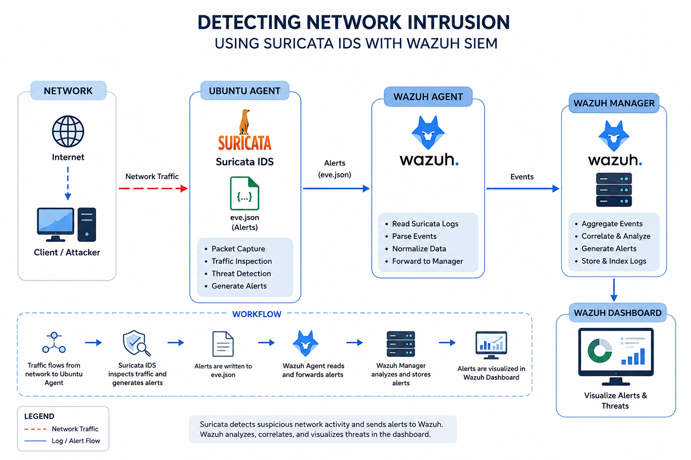
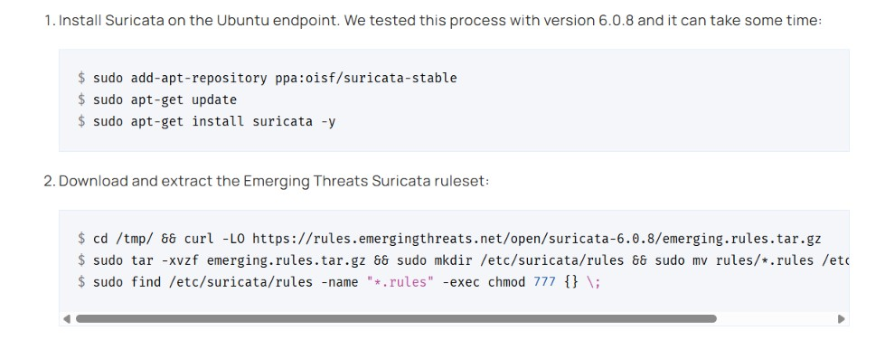
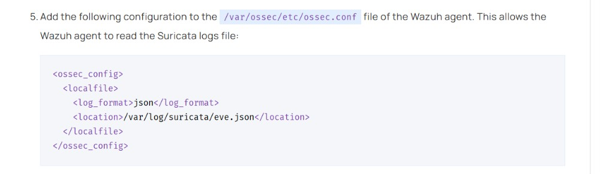
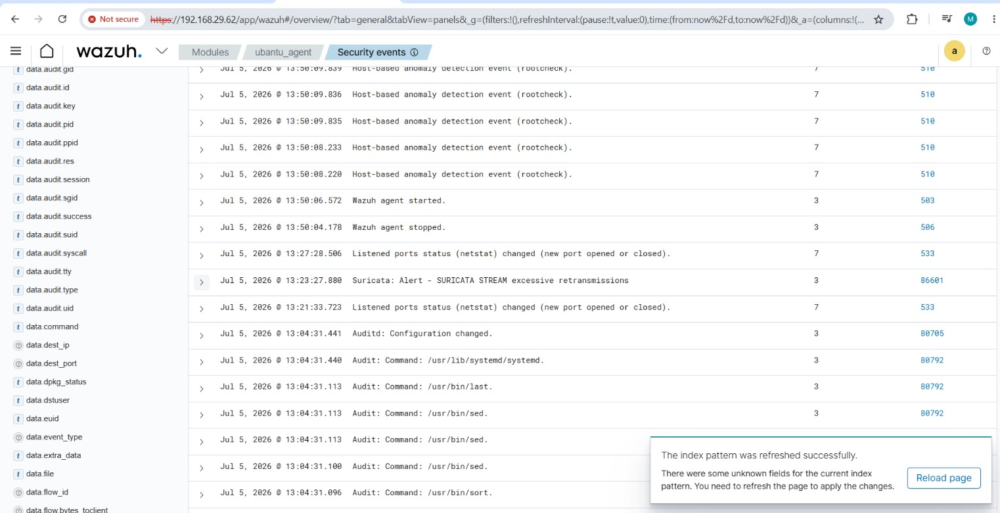
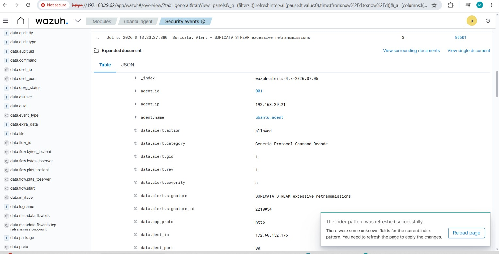

# Detecting Network Intrusion Using Suricata IDS with Wazuh SIEM

## Project Overview

This project demonstrates how to integrate **Suricata Intrusion Detection System (IDS)** with **Wazuh SIEM** to monitor and analyze network traffic for suspicious activities.

Suricata inspects network packets in real time and generates alerts when malicious or suspicious traffic is detected. Wazuh collects these alerts, correlates them, and displays them on the Wazuh Dashboard for security analysis.

---

## Objectives

- Understand Network Intrusion Detection Systems (NIDS)
- Install and configure Suricata IDS
- Integrate Suricata with Wazuh SIEM
- Monitor network traffic
- Detect suspicious network activities
- Analyze security alerts in the Wazuh Dashboard

---

## Lab Environment

| Component | Details |
|-----------|----------|
| SIEM | Wazuh 4.x |
| IDS | Suricata 6.x |
| Manager OS | Ubuntu Server |
| Agent OS | Ubuntu 22.04 |
| Virtualization | VirtualBox |
| Monitoring Feature | Network Intrusion Detection |

---

## Architecture Diagram

<p align="center">
  
</p>

---

## Prerequisites

- Wazuh Manager installed
- Ubuntu Agent installed
- Agent connected to Wazuh Manager
- Root privileges
- Internet connection

---

# Install Suricata IDS

Add the Suricata repository:

```bash
sudo add-apt-repository ppa:oisf/suricata-stable
```

Update the package list:

```bash
sudo apt-get update
```

Install Suricata:

```bash
sudo apt-get install suricata -y
```

Verify installation:

```bash
suricata --build-info
```
<p align="center">
  
</p>

---

## Download Emerging Threat Rules

```bash
cd /tmp/

curl -LO https://rules.emergingthreats.net/open/suricata-6.0.8/emerging.rules.tar.gz

sudo tar -xvzf emerging.rules.tar.gz

sudo mkdir -p /etc/suricata/rules

sudo mv rules/*.rules /etc/suricata/rules/

sudo find /etc/suricata/rules -name "*.rules" -exec chmod 777 {} \;
```

---

## Configure Suricata

Edit the configuration file:

```bash
sudo nano /etc/suricata/suricata.yaml
```

Modify the following values:

```yaml
HOME_NET: "<UBUNTU_IP>"

EXTERNAL_NET: "any"

default-rule-path: /etc/suricata/rules

rule-files:
  - "*.rules"

stats:
  enabled: yes

af-packet:
  - interface: enp0s3
```

> Replace **enp0s3** with your Ubuntu network interface.

<p align="center">
  
</p>

---

## Verify Network Interface

Run:

```bash
ifconfig
```

Example:

```text
enp0s3
inet 10.0.2.15
```

---

## Restart Suricata

```bash
sudo systemctl restart suricata
```

Verify status:

```bash
sudo systemctl status suricata
```

---

## Configure Wazuh Agent

Edit the Wazuh configuration:

```bash
sudo nano /var/ossec/etc/ossec.conf
```

Add the following configuration:

```xml
<ossec_config>

  <localfile>

    <log_format>json</log_format>

    <location>/var/log/suricata/eve.json</location>

  </localfile>

</ossec_config>
```

Save the file.

---

## Restart Wazuh Agent

```bash
sudo systemctl restart wazuh-agent
```

Verify status:

```bash
sudo systemctl status wazuh-agent
```

---

# Attack Simulation

Generate network traffic from the Wazuh Manager:

```bash
ping -c 20 "<UBUNTU_IP>"
```

Replace `<UBUNTU_IP>` with your Ubuntu Agent IP address.

---

## Detection Results

Wazuh automatically parses the **Suricata** log file:

```text
/var/log/suricata/eve.json
```

The following events can be detected:

- ICMP Ping Detection
- Port Scanning
- Suspicious Network Traffic
- Protocol Anomalies
- Emerging Threat Rule Matches

  <p align="center">
  
</p>

---

## Visualize Alerts

Open the **Wazuh Dashboard**.

Go to:

**Threat Hunting**

Search using:

```text
rule.groups:suricata
```

Review the generated alerts and investigate suspicious network activity.

---

## Troubleshooting

### Error

```text
Unable to find iface eth0: No such device

Couldn't init AF_PACKET socket

thread W#01-eth0 failed
```

### Resolution

Check your network interface name:

```bash
ifconfig
```

Update the interface in:

```text
/etc/suricata/suricata.yaml
```

Example:

```yaml
af-packet:

- interface: enp0s3
```

Restart Suricata:

```bash
sudo systemctl restart suricata
```

---

## Incident Analysis

### MITRE ATT&CK

- T1046 – Network Service Discovery
- T1595 – Active Scanning

---

## Threat-Hunting

Wazuh automatically parses the **Suricata** log file:

<p align="center">
  
</p>


```text
/var/log/suricata/eve.json


## Potential Risks

- Network Reconnaissance
- Port Scanning
- Unauthorized Access Attempts
- Malware Communication
- Command and Control (C2) Traffic

---

## Key Learnings

- Learned how Suricata IDS monitors network traffic.
- Integrated Suricata with Wazuh SIEM.
- Configured Emerging Threat rules.
- Generated network intrusion alerts.
- Investigated alerts using the Wazuh Dashboard.
- Understood how NIDS improves network security monitoring.

---

